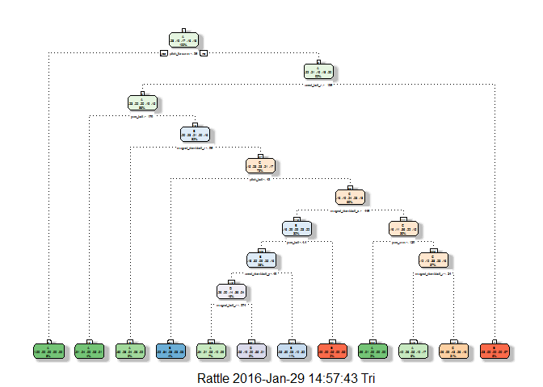
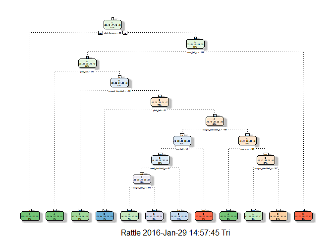
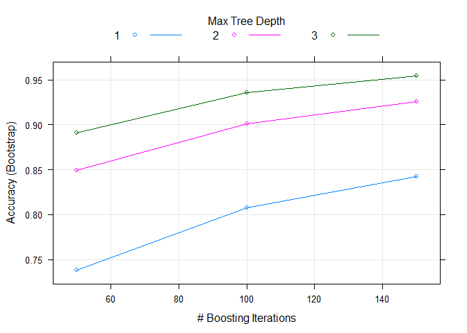

Project Background (From Coursera)
==================================

Using devices such as
*J**a**w**b**o**n**e**U**p*, *N**i**k**e**F**u**e**l**B**a**n**d*, and
*F**i**t**b**i**t* it is now possible to collect a large amount of data
about personal activity relatively inexpensively. These type of devices
are part of the quantified self movement - a group of enthusiasts who
take measurements about themselves regularly to improve their health, to
find patterns in their behavior, or because they are tech geeks. One
thing that people regularly do is quantify how much of a particular
activity they do, but they rarely quantify how well they do it. In this
project, your goal will be to use data from accelerometers on the belt,
forearm, arm, and dumbell of 6 participants. They were asked to perform
barbell lifts correctly and incorrectly in 5 different ways. More
information is available from the website here:
<http://groupware.les.inf.puc-rio.br/har> (see the section on the Weight
Lifting Exercise Dataset).

Data
----

The training data for this project are available here:
<https://d396qusza40orc.cloudfront.net/predmachlearn/pml-training.csv>

The test data are available here:
<https://d396qusza40orc.cloudfront.net/predmachlearn/pml-testing.csv>

In this project
---------------

The goal of this project is to predict the manner in which they did the
exercise. This is the "classe" variable in the training set. A report is
created describing how I built the model, how I used cross validation,
how I think the expected out of sample error is, and why I made the
choices I did.

Analysis Summary
================

In this project, I used basically three methods to train this dataset:
Random Forest, boosting random forest and decision tree. The results
showed that random forest outran the decision tree on decision tree.

    library(xlsx)
    library(rpart)
    library(caret)
    library(randomForest)
    library(rpart.plot)
    library(RColorBrewer)
    library(rattle)
    library(magrittr)

    trainurl <- "http://d396qusza40orc.cloudfront.net/predmachlearn/pml-training.csv"
    testurl <- "http://d396qusza40orc.cloudfront.net/predmachlearn/pml-testing.csv"

    ### If you do not have the data in your repository, then do the following code.
    # training <- read.csv(url(trainurl))
    # testing <- read.csv(url(testurl))
    ###

    training <- read.csv("pml-training.csv")
    testing <- read.csv("pml-testing.csv")

Getting and cleaning the Data
-----------------------------

I used the links professors provided to get the data I need in this
analysis. First of all, I tried to clean the data. Because there are
many NAs in the data, I selected them out and discarded them. In
addition, the first eight columns are useless in analysis because they
do not have any contribution to there performance. Then, I used
`nearZerovar` to further kicked out the variables which contribute less
in the data.

    nade <- apply(training, 2, function(x) which(is.na(x)) %>% length) %>% as.vector
    training <- training[, -which(nade == 19216)]
    testing <- testing[, -which(nade == 19216)]
    training <- training[, 9:ncol(training)]
    testing <- testing[, 9:ncol(testing)]
    rz <- nearZeroVar(training, saveMetrics = T)
    rz <- which(rz[, 4] == "TRUE") 
    training <- training[, -rz]
    testing <- testing[, -rz]
    set.seed(080604)
    intrain <- createDataPartition(y = training$classe, p = 0.6, list = FALSE)
    intraining <- training[intrain,] 
    intesting <- training[-intrain,]  

Principle Component Analysis
----------------------------

    pc <- preProcess(intraining[, -ncol(intraining)], method = "pca", pcaComp = 2, thresh = 0.95)
    intrainPC <- predict(pc, intraining[, -ncol(intraining)])
    modelFit <- train(intraining$classe ~ .,method = "rpart", data = intrainPC)
    testpc <- predict(pc, intraining[, -ncol(intraining)])
    confusionMatrix(intraining$classe, predict(modelFit, testpc))

    ## Confusion Matrix and Statistics
    ## 
    ##           Reference
    ## Prediction    A    B    C    D    E
    ##          A 2262   80  393  347  266
    ##          B  870  392  418  216  383
    ##          C  777  101  770  127  279
    ##          D  464  160  293  665  348
    ##          E  530  128  328  368  811
    ## 
    ## Overall Statistics
    ##                                           
    ##                Accuracy : 0.4161          
    ##                  95% CI : (0.4072, 0.4251)
    ##     No Information Rate : 0.4164          
    ##     P-Value [Acc > NIR] : 0.5259          
    ##                                           
    ##                   Kappa : 0.2498          
    ##  Mcnemar's Test P-Value : <2e-16          
    ## 
    ## Statistics by Class:
    ## 
    ##                      Class: A Class: B Class: C Class: D Class: E
    ## Sensitivity            0.4614  0.45528  0.34968  0.38595  0.38860
    ## Specificity            0.8420  0.82712  0.86589  0.87417  0.86025
    ## Pos Pred Value         0.6756  0.17201  0.37488  0.34456  0.37460
    ## Neg Pred Value         0.6866  0.95062  0.85271  0.89255  0.86724
    ## Prevalence             0.4164  0.07311  0.18699  0.14631  0.17722
    ## Detection Rate         0.1921  0.03329  0.06539  0.05647  0.06887
    ## Detection Prevalence   0.2843  0.19353  0.17442  0.16389  0.18385
    ## Balanced Accuracy      0.6517  0.64120  0.60778  0.63006  0.62442

From the results of PCA, it can seen that the accuracy is not in a way
acceptable, therefore, maybe it because the `rpart` mnethod is not
suitable in this data set. So, I used decision tree to directly train
the model.

Decision Tree
-------------

    set.seed(080604)
    fit1 <- train(classe ~ ., data = intraining, method = "rpart")
    fancyRpartPlot(fit1$finalModel)

  

    pred1 <- predict(fit1, newdata = intesting) %>% confusionMatrix(., intesting$classe) ; acc1 <- pred1$overall[1] ; acc1

    ## Accuracy 
    ## 0.595845

    fit11 <- rpart(classe ~ ., data = intraining, method = "class")
    fancyRpartPlot(fit1$finalModel)

  

    pred2 <- predict(fit1, newdata = intesting) %>% confusionMatrix(., intesting$classe) ; acc2 <- pred2$overall[1] ; acc2

    ## Accuracy 
    ## 0.595845

    fit12 <- train(classe ~ ., data = intraining, method = "rpart", trControl = trainControl(method = "cv", number = 3))
    pred3 <- predict(fit12, newdata = intesting) %>% confusionMatrix(., intesting$classe) ; acc3 <- pred3$overall[1] ; acc3

    ## Accuracy 
    ## 0.595845

I used decision tree to train the model. Cross validation was carryied
out by setting *n**u**m**b**e**r* = 3. However, the accuracy in decision
tree is extremely low. Therefore, decision tree may not considered a
good way in predicting the performance given the data set. Therefore, I
tried to use another algorithm to train my model.

Random Forest
-------------

    set.seed(080604)
    fit2 <- train(classe ~ ., data = intraining, method = "rf", prox = TRUE)
    pred4 <- predict(fit2, newdata = intesting) %>% confusionMatrix(., intesting$classe) ; acc4 <- pred4$overall[1] ; acc4

    ##  Accuracy 
    ## 0.9910783

    fit21 <- randomForest(classe ~ ., data = intraining, type = "class")
    pred5 <- predict(fit21, newdata = intesting) %>% confusionMatrix(., intesting$classe) ; acc5 <- pred5$overall[1] ; acc5

    ##  Accuracy 
    ## 0.9926077

    fit22 <- train(classe ~ ., data = intraining, method = "rf", prox =
                     TRUE, trControl = trainControl(method = "cv", number = 3))
    pred6 <- predict(fit22, newdata = intesting) %>% confusionMatrix(., intesting$classe) ; acc6 <- pred6$overall[1] ; acc6

    ##  Accuracy 
    ## 0.9906959

In this part, I used random forest to train the dataset. Without
exception, the cross validation was also conducted. Fortunately, in this
algorithm I already got an quite high accuracy. Hence, this result may
be used for the rest quiz of 20 test.

Boosting
--------

    gbm <- train(classe ~ ., method = "gbm", data = intraining, verbose = F)

    ## Loading required package: gbm

    ## Loading required package: survival

    ## 
    ## Attaching package: 'survival'

    ## The following object is masked from 'package:caret':
    ## 
    ##     cluster

    ## Loading required package: splines

    ## Loading required package: parallel

    ## Loaded gbm 2.1.1

    ## Loading required package: plyr

    pred7 <- predict(gbm, newdata = intesting) %>% confusionMatrix(., intesting$classe) ; pred7$overall[1]

    ##  Accuracy 
    ## 0.9581953

    print(gbm)

    ## Stochastic Gradient Boosting 
    ## 
    ## 11776 samples
    ##    51 predictor
    ##     5 classes: 'A', 'B', 'C', 'D', 'E' 
    ## 
    ## No pre-processing
    ## Resampling: Bootstrapped (25 reps) 
    ## Summary of sample sizes: 11776, 11776, 11776, 11776, 11776, 11776, ... 
    ## Resampling results across tuning parameters:
    ## 
    ##   interaction.depth  n.trees  Accuracy   Kappa      Accuracy SD
    ##   1                   50      0.7380073  0.6679682  0.009180378
    ##   1                  100      0.8079486  0.7568988  0.007835608
    ##   1                  150      0.8425829  0.8007069  0.007722167
    ##   2                   50      0.8495116  0.8093352  0.006376460
    ##   2                  100      0.9011286  0.8748286  0.006241197
    ##   2                  150      0.9253656  0.9055297  0.005729979
    ##   3                   50      0.8908556  0.8617628  0.005167446
    ##   3                  100      0.9359296  0.9188979  0.005361850
    ##   3                  150      0.9545144  0.9424291  0.004345983
    ##   Kappa SD   
    ##   0.011658349
    ##   0.009846324
    ##   0.009731529
    ##   0.008002832
    ##   0.007867252
    ##   0.007232841
    ##   0.006475192
    ##   0.006790351
    ##   0.005507325
    ## 
    ## Tuning parameter 'shrinkage' was held constant at a value of 0.1
    ## 
    ## Tuning parameter 'n.minobsinnode' was held constant at a value of 10
    ## Accuracy was used to select the optimal model using  the largest value.
    ## The final values used for the model were n.trees = 150,
    ##  interaction.depth = 3, shrinkage = 0.1 and n.minobsinnode = 10.

    plot(gbm)

  
 In this part I used boosting random forest to train the model. Getting
the accuracy is quite high, I think this traning is good enough.
Although random forest is already accurate enough.

Out of Sample Error
-------------------

    data.frame(rf1 = 1 - acc4, rf2 = 1 - acc5, rf3 = 1 - acc6)

    ##                  rf1         rf2         rf3
    ## Accuracy 0.008921744 0.007392302 0.009304104

In this part, I showed the out of sample error, but limited only in the
algorithm random forest. From the results, it is obvious that the sample
error is quite low, which shows that the training is basically correct.

Conclusion
----------

In this project, I used PCA, decision tree, random forest nad boosting
methods to train this data set. From the result, it can be seen that the
accuracy is most highest if random forest is used. But the drawback is
that random forest took too much time to finish the trainig process.
Perhaps the training data set can be subgrouped again in order to speed
up the training process. Not but the least, the accuracy of random
forest is quite high, almost 100% (can be seen from the sample error).
Hence in this data set, we may conclude that random forest is the best
fitted model, although we still need to aware of the possibility of
overfitting.

Prediction of Quiz
------------------

    print(predict(fit21, newdata = testing, type = "class"))

    ##  1  2  3  4  5  6  7  8  9 10 11 12 13 14 15 16 17 18 19 20 
    ##  B  A  B  A  A  E  D  B  A  A  B  C  B  A  E  E  A  B  B  B 
    ## Levels: A B C D E

Because there are still another testing data set, so this part is the
predicting result of the quiz.
